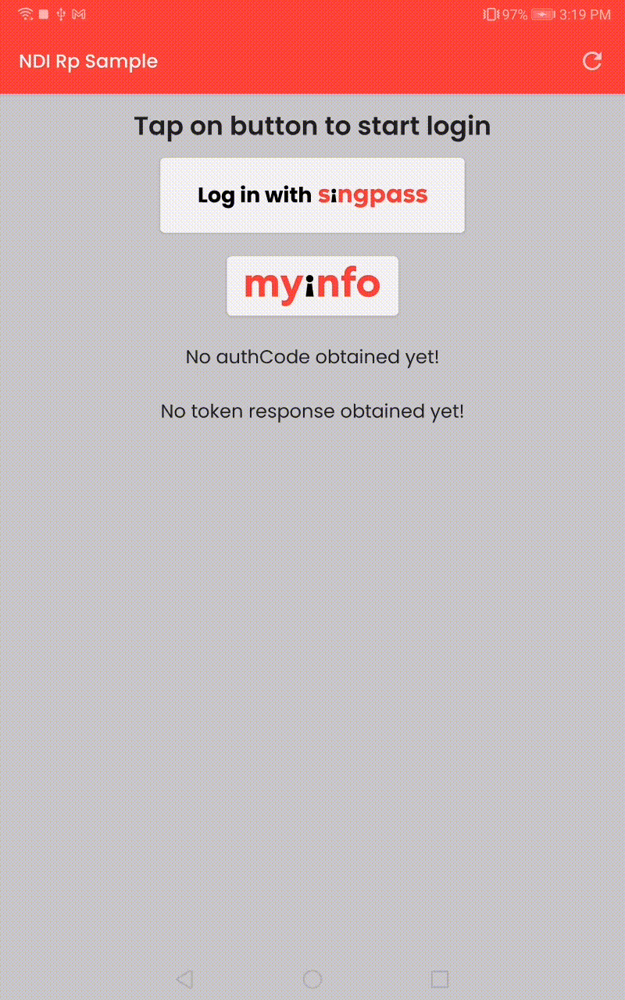
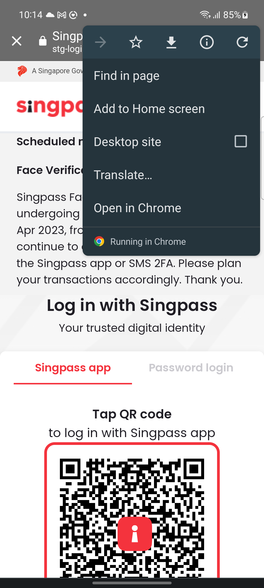
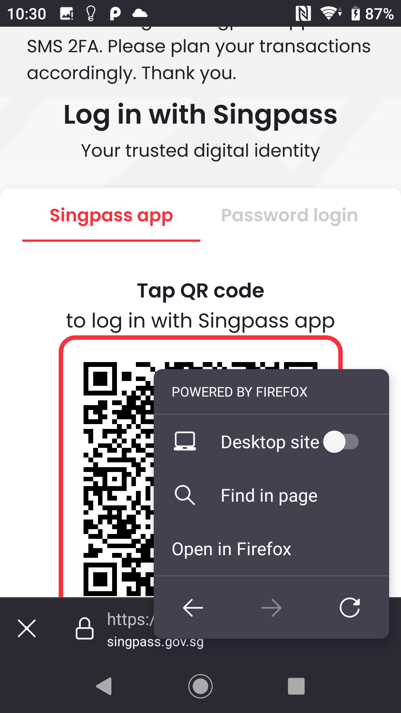
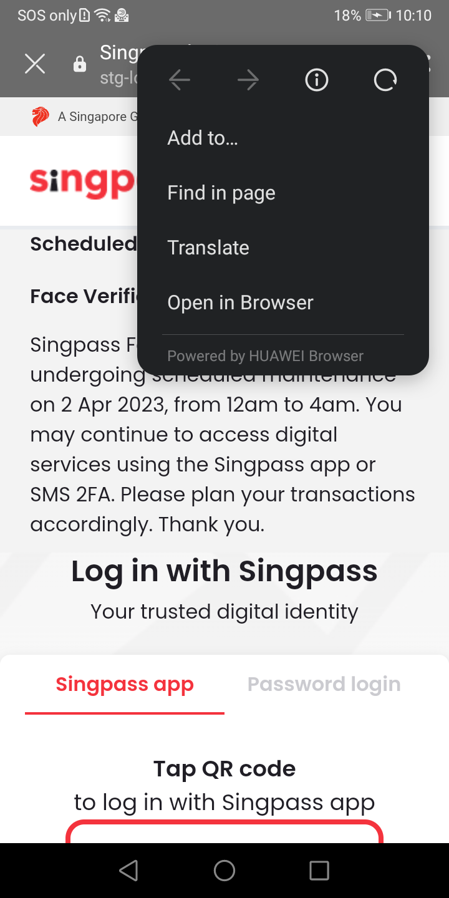
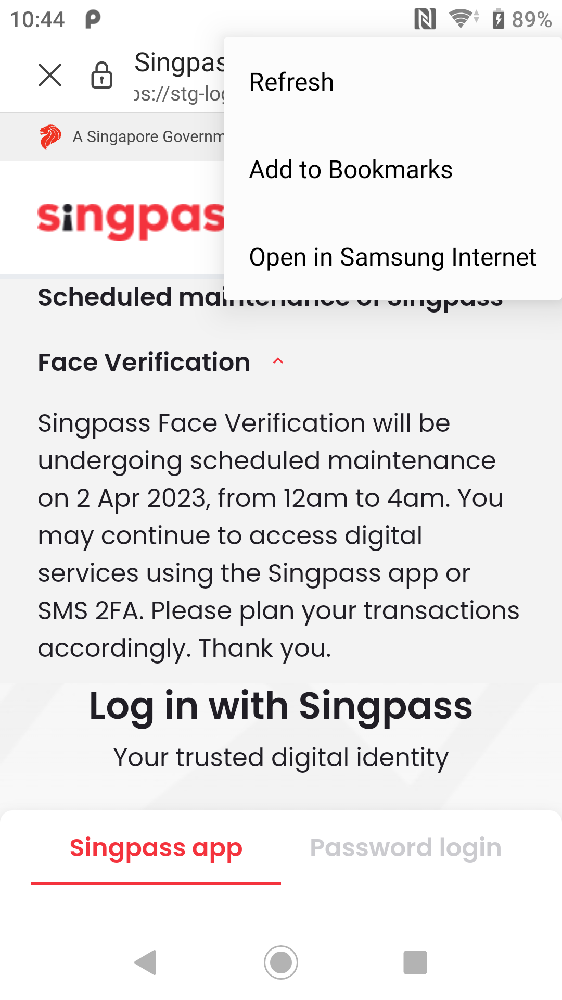

# Migrating away from [WebView](https://developer.android.com/reference/android/webkit/WebView) for Android Mobile app Singpass Logins

Usage of WebViews for web logins are not recommended due to security and usability reasons documented in [RFC8252](https://www.rfc-editor.org/rfc/rfc8252). Google has done the [same](https://developers.googleblog.com/2021/06/upcoming-security-changes-to-googles-oauth-2.0-authorization-endpoint.html) for Google Sign-in in 2021.

> This best current practice requires that only external user-agents
like the browser are used for OAuth by native apps.  It documents how
native apps can implement authorization flows using the browser as
the preferred external user-agent as well as the requirements for
authorization servers to support such usage.

*Quoted from RFC8252.*

This repository has codes for a sample Android application implementing the recommended [Proof Key for Code Exchange (PKCE)](https://www.rfc-editor.org/rfc/rfc7636) for Singpass logins. The application will demonstrate the Singpass login flow while utilizing [Chrome Custom Tabs](https://developer.chrome.com/docs/android/custom-tabs/#:~:text=Custom%20Tabs%20is%20a%20browser,to%20resort%20to%20a%20WebView.) or external mobile web browser along with PKCE leveraging on the Android [AppAuth](https://github.com/openid/AppAuth-Android) library.


# Sequence Diagram

<br>
*RP stands for **Relying Party**

- 1a) Call **RP Backend** to obtain backend generate `code_challenge`, `code_challenge_method` along with `state` and `nonce` if required. #
<br><br>
- 1b) **RP Backend** responds with the requested parameters. (`code_challenge`, `code_challenge_method`, `state`, `nonce`) #
  <br><br>
- 2a) Open the Authorization endpoint in web browser via [AppAuth](https://github.com/openid/AppAuth-Android) providing query params of `redirect_uri`*, `client_id`, `scope`, `code_challenge`, `code_challenge_method` along with `state` and `nonce` if required. There can be other query params provided if needed. e.g. (`purpose_id` for myInfo use cases)
  <br><br>
- 2b) The `authorization code` will be delivered back to **RP Mobile App**.
<br><br>
- 3a) **RP Mobile App** Upon reception of `authorization code`, proceed to relay the Authorization code back to **RP Backend**. #
  <br><br>
- 3b) **RP Backend** will use the `authorization code` along with the generated `code_verifier` along with `state` and `nonce` if required, and do client assertion to call the token endpoint to obtain ID/access tokens.
<br><br>
- 3c) Token endpoint responds with the token payload to **RP Backend**.
  <br><br>
- 3d) **RP Backend** process the token payload and does its required operations and responds to **RP Mobile App** with the appropriate session state tokens or data. #
  <br><br>

&#8203;* - Take note that the `redirect_uri` should be a non-https url that represents the app link of the **RP Mobile App** as configured in the [AppAuth](https://github.com/openid/AppAuth-Android) library as shown in the [AndroidManifest.xml](#In-the-AndroidManifest.xml) implementation.

&#8203;# - It is up to the RP to secure the connection between **RP Mobile App** and **RP Backend**

# Potential changes/enhancements for RP Backend
1. Implement endpoint to serve `code_challenge`, `code_challenge_method`, `state`, `nonce` and other parameters needed for **RP Mobile App** to initiate the login flow.
   <br><br>
2. Implement endpoint in receive `authorization code`, `state` and other required parameters.
3. Register your new `redirect_uri` for your OAuth client_id

# Potential changes/enhancements for RP Mobile App
1. Integrate [AppAuth](https://github.com/openid/AppAuth-Android) library to handle launching of authorization endpoint webpage in a [Chrome Custom Tabs](https://developer.chrome.com/docs/android/custom-tabs/#:~:text=Custom%20Tabs%20is%20a%20browser,to%20resort%20to%20a%20WebView.) or external mobile web browser.
   <br><br>
2. Implement api call to **RP Backend** to request for `code_challenge`, `code_challenge_method`, `state` and `nonce` if required and other parameters.
   <br><br>
3. Implement api call to send `authorization code`, `state` and other needed parameters back to **RP Backend**.

# Other Notes
- Do **NOT** use the query param `app_launch_url` when opening the authorization endpoint webpage for Android as it will break the flow with [AppAuth](https://github.com/openid/AppAuth-Android) library.
  <br><br>
- Strongly recommended to use either [Android DeepLinks](https://developer.android.com/training/app-links#deep-links) or [iOS URL Schemes](https://support.apple.com/en-sg/guide/shortcuts/apd621a1ad7a/6.0/ios/16.0) for your `redirect_uri`. This will prevent usability issues when Chrome Custom Tabs or an external web browser redirects back to the RP Mobile App. An example of such a URI is: `sg.gov.singpass.app://ndisample.gov.sg/rp/sample`.
  <br><br>
- Although the sample mobile application code in this repository provides an example of how to receive the token endpoint response from the RP Backend, RPs will need to cater for their own processing of the token response instead.
  <br><br>
- In the case where using use either [Android DeepLinks](https://developer.android.com/training/app-links#deep-links) or [iOS URL Schemes](https://support.apple.com/en-sg/guide/shortcuts/apd621a1ad7a/6.0/ios/16.0) as the `redirect_uri` is not possible, an additional query parameter, `redirect_uri_https_type=app_claimed_https` should be added to the authorization endpoint when launching in the in-app browser. This applies only to direct Singpass logins, and not to Myinfo logins. An example of such a URI is: `https://stg-id.singpass.gov.sg/auth?redirect_uri=https%3A%2F%2Fapp.singpass.gov.sg%2Frp%2Fsample&client_id=ikivDlY5OlOHQVKb8ZIKd4LSpr3nkKsK&response_type=code&state=9_fVucO3cHJIIjR50wr2ctFPYIJLMt_NV6rvLBNQxlztWSCCWbCYMkesXdBC93lX&nonce=7d0c9f09-1c1a-400e-b026-77cc7bc89cd0&scope=openid&code_challenge=ZnRSoTcoIncnebg0mCqNT-E5fbRNQ8zcYkly52-qWxw&code_challenge_method=S256&redirect_uri_https_type=app_claimed_https`.
 <br><br>
- Do contact us if you face any issues adding your `redirect_uri`.

# Implementation Details

## Required dependencies

AppAuth Android Library
> implementation "net.openid:appauth:0.11.1"

Androidx Browser (Chrome Custom Tabs)
> implementation "androidx.browser:browser:1.5.0"

## Implementation

### In the AndroidManifest.xml

Configure [AppAuth](https://github.com/openid/AppAuth-Android) RedirectUriReceiverActivity's  `IntentFilter` in AndroidManifest which is also the `redirect_uri`. 
```xml
<activity
    android:name="net.openid.appauth.RedirectUriReceiverActivity"
    android:exported="true"
    tools:node="replace">
    
    <intent-filter>
        <action android:name="android.intent.action.VIEW"/>
        <category android:name="android.intent.category.DEFAULT"/>
        <category android:name="android.intent.category.BROWSABLE"/>
        <data android:scheme="sg.gov.singpass.app"
            android:host="ndisample.gov.sg"
            android:path="/rp/sample"/>
    </intent-filter>

    <intent-filter>
        <action android:name="android.intent.action.VIEW"/>
        <category android:name="android.intent.category.DEFAULT"/>
        <category android:name="android.intent.category.BROWSABLE"/>
        <data android:scheme="sg.gov.singpass.app"
            android:host="ndisample.gov.sg"
            android:path="/rp/sample/"/>
    </intent-filter>

    <!--  This is for when you need to use https scheme redirect_uri  -->
    <!--  Once again we emphasize that we do NOT recommend using https scheme  -->
    <intent-filter android:autoVerify="true">
        <action android:name="android.intent.action.VIEW"/>
        <category android:name="android.intent.category.DEFAULT"/>
        <category android:name="android.intent.category.BROWSABLE"/>
        <data android:scheme="https"
            android:host="app.singpass.gov.sg"
            android:path="/rp/sample"/>
    </intent-filter>

    <intent-filter android:autoVerify="true">
        <action android:name="android.intent.action.VIEW"/>
        <category android:name="android.intent.category.DEFAULT"/>
        <category android:name="android.intent.category.BROWSABLE"/>
        <data android:scheme="https"
            android:host="app.singpass.gov.sg"
            android:path="/rp/sample/"/>
    </intent-filter>

</activity>
```
<br>

### In the ViewModel

The below code snippets should be inside a ViewModel or any other component that survives an orientation change in an Android application.

<br>

Create the Oauth service configuration
```kotlin
  // This is the json string that describes the current Oauth service
  // This example is using the test environment for MyInfo Singpass login 
  // Todo: Modify these values for your use-case e.g. Singpass, MyInfo etc 
  val jsonConfig = "{" +
    "\"issuer\":\"https://test.api.myinfo.gov.sg\"," +
    "\"authorizationEndpoint\":\"https://test.api.myinfo.gov.sg/com/v4/authorize\"," +
    "\"tokenEndpoint\":\"https://test.api.myinfo.gov.sg/com/v4/token\"" +
  "}"
  
  val serviceConfig = AuthorizationServiceConfiguration.fromJson(jsonConfig)
```
<br>

Create the OAuth authorization request
```kotlin
val authRequest = AuthorizationRequest.Builder(
  serviceConfig, // from the above section
  client_id, // RP client_id
  ResponseTypeValues.CODE, // code
  Uri.parse(refirect_uri) // redirect_uri
).apply {
    
  val additionalParams = mutableMapOf<String, String>()

  // MyInfo Singpass login does not need nonce and state
  // It needs purpose_id and has different scope values
  if (isMyinfo) {
    setScope(app.getString(R.string.myinfo_scope))
    additionalParams.put("purpose_id", "demonstration")
    setNonce(null)
    setState(null)
  } else {
    setScope("openid")
    setState(state) // state generated from RP Backend
    setNonce(nonce) // nonce generated from RP Backend
  }

  // code_challenge and code_challenge_method generated from RP Backend
  // Set code_challenge for code_verifier as AppAuth library
  // does NOT natively support externally generated code_verifier
  // Set code_challenge as code_verifier as a hack       
  // as we are not calling token endpoint from the mobile app        
  setCodeVerifier(code_challenge, code_challenge, code_challenge_method)

  if (additionalParams.isNotEmpty()) {
    setAdditionalParameters(additionalParams)
  }
}.build()
```
<br>

Create the OAuth authorization service
```kotlin

// This config can be configured for appAuth to deny usage of certain web browsers.
// As of 26th May 2023 we are seeing a bug on the Microsoft Edge browser affect app linking
val appAuthConfig = AppAuthConfiguration.Builder()
    .setBrowserMatcher(
        BrowserDenyList(
            VersionedBrowserMatcher(
                "com.microsoft.emmx", // package name
                setOf("Ivy-Rk6ztai_IudfbyUrSHugzRqAtHWslFvHT0PTvLMsEKLUIgv7ZZbVxygWy_M5mOPpfjZrd3vOx3t-cA6fVQ=="), // SHA512 hash of the signing certificate
                true, // use Chrome Custom Tabs
                VersionRange.ANY_VERSION // can configure to deny specific versions or version ranges
            )
        )
    ).build()

val authService = AuthorizationService(applicationContext, appAuthConfig)
// or below if no appAuthConfig needed
val authService = AuthorizationService(applicationContext)
```
<br>

Create the Intent to launch the Authorization Endpoint in a Chrome Custom Tab or external web browser
```kotlin

// Todo: Modify to make the custom tabs fit your application theme for light mode
private val customTabColorSchemeParams = CustomTabColorSchemeParams.Builder().apply {
  val toolbarColor = ContextCompat.getColor(app, R.color.primary)
  setToolbarColor(toolbarColor)
  setSecondaryToolbarColor(toolbarColor)
}.build()

// Todo: Modify to make the custom tabs fit your application theme for dark mode
private val darkCustomTabColorSchemeParams = CustomTabColorSchemeParams.Builder().apply {
  val toolbarColor = ContextCompat.getColor(app, R.color.grey60)
  setToolbarColor(toolbarColor)
  setSecondaryToolbarColor(toolbarColor)
}.build()

// Create the custom tabs intent with CustomTabsIntent.Builder
// Modify how you want the custom tabs to look using the androidx.browser api
// This builder will also function to warm up the custom tabs in the background for faster custom tabs launching
val customTabsIntent = authService.customTabManager.createTabBuilder(authRequest.toUri()).apply {
  setColorSchemeParams(CustomTabsIntent.COLOR_SCHEME_DARK, darkCustomTabColorSchemeParams)
  setColorSchemeParams(CustomTabsIntent.COLOR_SCHEME_LIGHT, customTabColorSchemeParams)
  setShowTitle(true)
  setStartAnimations(app, android.R.anim.slide_in_left, android.R.anim.fade_out)
  setExitAnimations(app, android.R.anim.fade_in, android.R.anim.slide_out_right)
}.build()

try {
  authIntent = authService.getAuthorizationRequestIntent(authRequest, customTabsIntent)
} catch (e: ActivityNotFoundException) {
//  Todo: This toast here is just to indicate the error, please show your own error UI 
  Toast.makeText(app, "No suitable web browser found!", Toast.LENGTH_SHORT).show()
}
```

## In the UI Layer (Activity or Fragment)

<br>

Create an `authActivityLauncher` in your Activity or Fragment.
The `authActivityLauncher` will listen for the authorization code or any errors returned from the Chrome Custom Tabs or external web browser
```kotlin
val authActivityLauncher = registerForActivityResult(ActivityResultContracts.StartActivityForResult()) {
    val data = it.data
    if (data != null) {
        val resp = AuthorizationResponse.fromIntent(data)
        val ex = AuthorizationException.fromIntent(data)

        if (ex != null) { 
            // Todo: This toast here is just to indicate the error, please show your own error UI 
            Toast.makeText(app, "Error occurred: ${ex.errorDescription}", Toast.LENGTH_SHORT).show()
            return@registerForActivityResult
        }

        if (resp != null) {
            // Todo: obtain the authorization code and state and send to RP Backend 
            viewModel.sendAuthCodeToBackend(
                code = resp.authorizationCode ?: "",
                state = resp.state
            )
        }
    }
}
```
<br>

Launch the authorization Intent created in the viewModel
```kotlin
viewModel.authIntent?.run {   
    authActivityLauncher.launch(this)
} ?:
// Todo: This toast here is just to indicate the error, please show your own error UI 
Toast.makeText(app, "Error occurred: Intent is null!", Toast.LENGTH_SHORT).show()
```

## Demo Video/s

### MyInfo Consent
| MyInfo Mockpass Demo<br>(Chrome Custom Tab) | MyInfo Mockpass Demo<br>(External browser fallback) |     
|---|---|
| </img> | </img> |

### Singpass Login
| Singpass Demo<br>(Chrome Custom Tab) | Singpass Demo<br>(External browser fallback) |
|---|---|
|  </img> | </img> |

## FAQ

- How do i know if I am using [Chrome Custom Tabs](https://developer.chrome.com/docs/android/custom-tabs/#:~:text=Custom%20Tabs%20is%20a%20browser,to%20resort%20to%20a%20WebView.) (CCT), external web browser or [WebView](https://developer.android.com/reference/android/webkit/WebView)?

You can tell if the Singpass login page is being open in [Chrome Custom Tabs](https://developer.chrome.com/docs/android/custom-tabs/#:~:text=Custom%20Tabs%20is%20a%20browser,to%20resort%20to%20a%20WebView.) by looking at the dropdown menu. It should indicate that the [Chrome Custom Tabs](https://developer.chrome.com/docs/android/custom-tabs/#:~:text=Custom%20Tabs%20is%20a%20browser,to%20resort%20to%20a%20WebView.) is being powered or run by an implemented web browser. And there usually is an option to open the webpage in the indicated web browser. Some of the web browsers that implement the [Chrome Custom Tabs](https://developer.chrome.com/docs/android/custom-tabs/#:~:text=Custom%20Tabs%20is%20a%20browser,to%20resort%20to%20a%20WebView.) feature is shown below.

| Brave Browser CCT                                                                                                  | Chrome Browser CCT                                                                                                   |     
|--------------------------------------------------------------------------------------------------------------------|----------------------------------------------------------------------------------------------------------------------|
| </img> | </img> |

| Firefox Browser CCT                                                                                                    | Firefox Focus Browser CCT                                                                                                          |     
|------------------------------------------------------------------------------------------------------------------------|------------------------------------------------------------------------------------------------------------------------------------|
| </img> | </img> |

| Microsoft Edge Browser CCT                                                                                                   | Huawei Browser CCT                                                                                                           |     
|------------------------------------------------------------------------------------------------------------------------------|------------------------------------------------------------------------------------------------------------------------------|
| </img> | </img> |

| Samsung Internet Browser CCT                                                                                                            |    
|-----------------------------------------------------------------------------------------------------------------------------------------|
| </img> |

<br>

You can tell if the Singpass login page is opened in a external web browser by looking for the editable address bar. Below are 2 examples.

| Opera Web browser                                                                                            | DuckDuckGo Browser                                                                                             |     
|--------------------------------------------------------------------------------------------------------------|----------------------------------------------------------------------------------------------------------------|
| </img> | </img> |

## Polling 

Vote [here](https://github.com/singpass/Android-Singpass-in-app-browser-login-demo/discussions/1) to indicate if you would like a library that handles all these implementation
