# Do NOT use [WebViews](https://developer.android.com/reference/android/webkit/WebView) for mobile app Singpass Logins

Usage of WebViews for web logins are not recommended (and not allow for Singpass) due to security and usability reasons documented in [RFC8252](https://www.rfc-editor.org/rfc/rfc8252). Google has done the [same](https://developers.googleblog.com/2021/06/upcoming-security-changes-to-googles-oauth-2.0-authorization-endpoint.html) for Google Sign-in in 2021.

> This best current practice requires that only external user-agents
like the browser are used for OAuth by native apps.  It documents how
native apps can implement authorization flows using the browser as
the preferred external user-agent as well as the requirements for
authorization servers to support such usage.

*Quoted from RFC8252.*

This repository has codes for a sample Android application implementing the recommended [Proof Key for Code Exchange (PKCE)](https://www.rfc-editor.org/rfc/rfc7636) for Singpass logins. 
This sample application demonstrates usage of [Chrome Auth Tab](https://developer.chrome.com/docs/android/custom-tabs/guide-auth-tab) or [Chrome Custom Tabs](https://developer.chrome.com/docs/android/custom-tabs/#:~:text=Custom%20Tabs%20is%20a%20browser,to%20resort%20to%20a%20WebView.) with external mobile web browser as a fallback via the Android [AppAuth](https://github.com/openid/AppAuth-Android) library.

# Sequence Diagram

### FAPI2 Singpass Login on mobile app
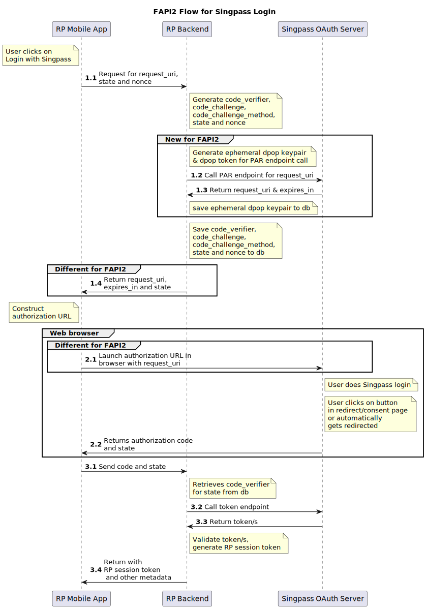
 
### Legacy Singpass Login on mobile app
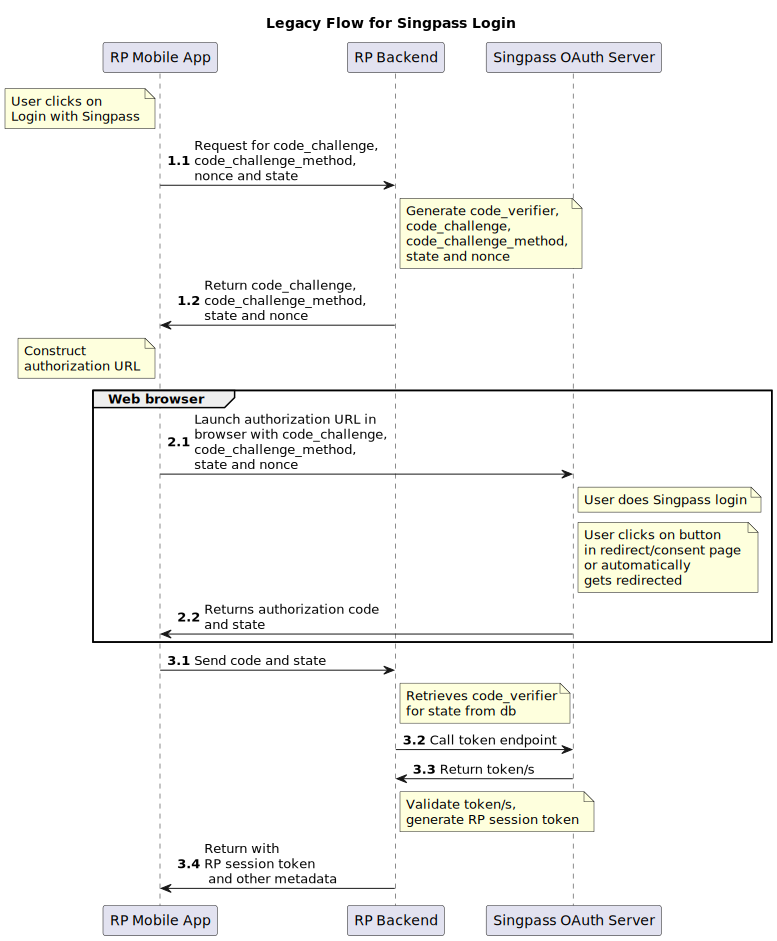
 

Developers can use the login module in this repository to integrate the Singpass login mobile flow. Read the [ReadMe.md](/login/ReadMe.md) of the login module for integration instructions.

# Other Notes
- Do **NOT** use the query param `app_launch_url` when opening the authorization endpoint webpage for Android as it will break the flow with [AppAuth](https://github.com/openid/AppAuth-Android) library.
    
- FAPI2 for Singpass only allows use of [Android AppLinks](https://developer.android.com/training/app-links/about) or [iOS Universal link](https://developer.apple.com/documentation/xcode/supporting-associated-domains) for your `redirect_uri`. E.g. `https://app.singpass.gov.sg/rpsample`
    
- An additional query parameter, `redirect_uri_https_type=app_claimed_https` should be added to the authorization endpoint when launching in the in-app browser.   
An example of such a URL is:  
  https://stg-id.singpass.gov.sg/fapi/auth?client_id=pJ4rxHxQBiGtHSbNCLUxoD3fUVi850SD&request_uri=urn%3Aietf%3Aparams%3Aoauth%3Arequest_uri%3AOdyf1eyQg8LxYrbHooRPM&redirect_uri_https_type=app_claimed_https
  This will present the user with a interstitial screen with a button if the web browser does not redirect the user back to the mobile app automatically.

## FAQ

- How do i know if I am using [Chrome Custom/Auth Tabs](https://developer.chrome.com/docs/android/custom-tabs/#:~:text=Custom%20Tabs%20is%20a%20browser,to%20resort%20to%20a%20WebView.) (CCT), external web browser or [WebView](https://developer.android.com/reference/android/webkit/WebView)?

You can tell if the Singpass login page is being open in [Chrome Custom Tabs](https://developer.chrome.com/docs/android/custom-tabs/#:~:text=Custom%20Tabs%20is%20a%20browser,to%20resort%20to%20a%20WebView.) by looking at the dropdown menu. It should indicate that the [Chrome Custom Tabs](https://developer.chrome.com/docs/android/custom-tabs/#:~:text=Custom%20Tabs%20is%20a%20browser,to%20resort%20to%20a%20WebView.) is being powered or run by an implemented web browser. And there usually is an option to open the webpage in the indicated web browser. Some of the web browsers that implement the [Chrome Custom Tabs](https://developer.chrome.com/docs/android/custom-tabs/#:~:text=Custom%20Tabs%20is%20a%20browser,to%20resort%20to%20a%20WebView.) feature is shown below.

| Brave Browser CCT                                                                                                  | Chrome Browser CCT                                                                                                   |     
|--------------------------------------------------------------------------------------------------------------------|----------------------------------------------------------------------------------------------------------------------|
| 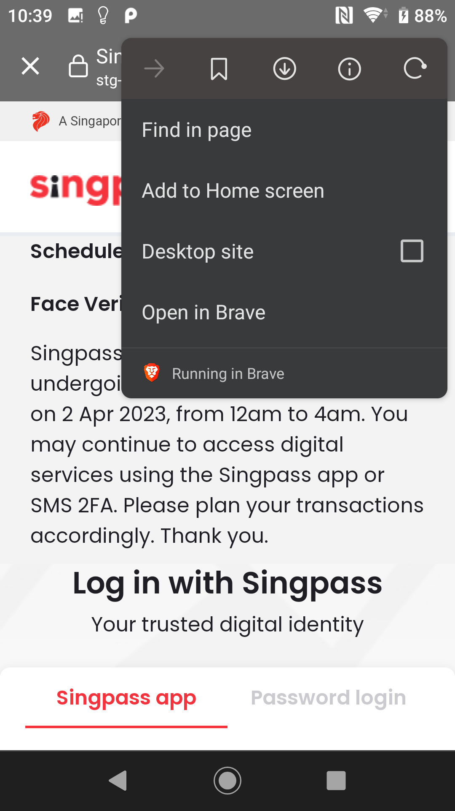</img> | 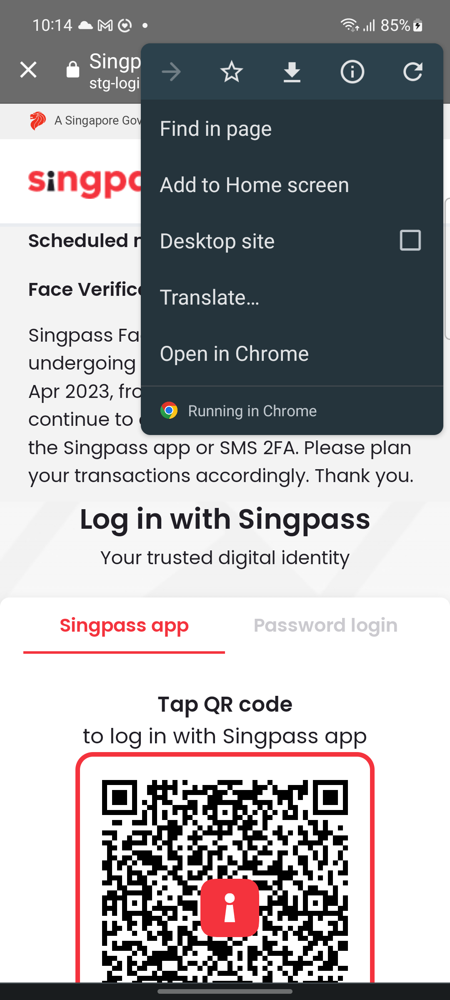</img> |

| Firefox Browser CCT                                                                                                    | Firefox Focus Browser CCT                                                                                                          |     
|------------------------------------------------------------------------------------------------------------------------|------------------------------------------------------------------------------------------------------------------------------------|
| 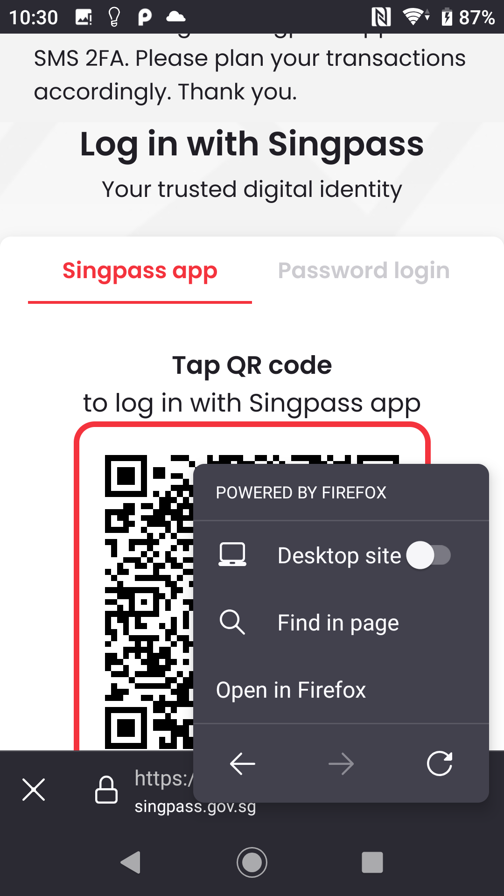</img> | 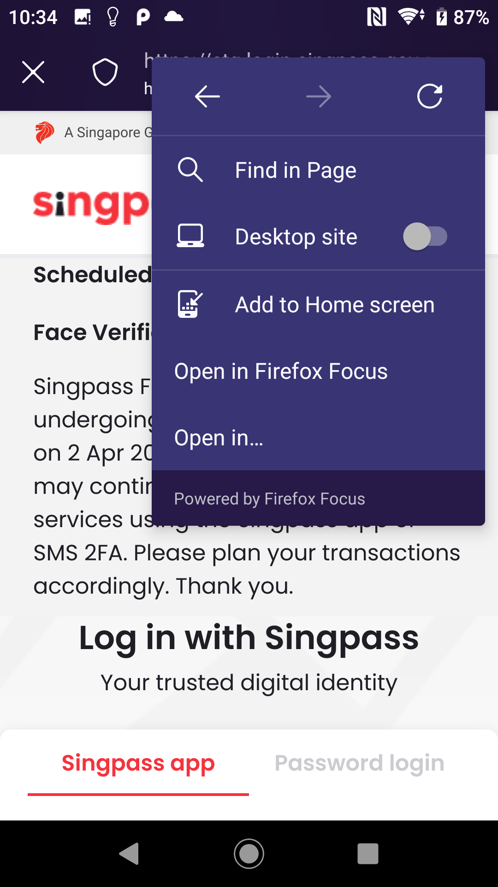</img> |

| Microsoft Edge Browser CCT                                                                                                   | Huawei Browser CCT                                                                                                           |     
|------------------------------------------------------------------------------------------------------------------------------|------------------------------------------------------------------------------------------------------------------------------|
| 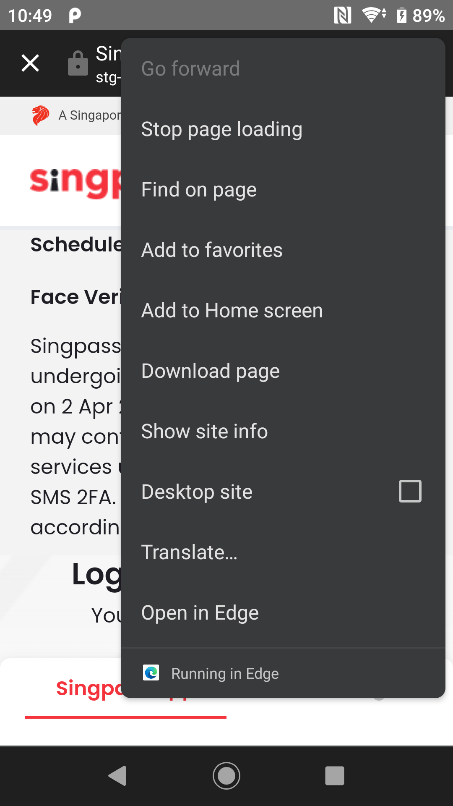</img> | 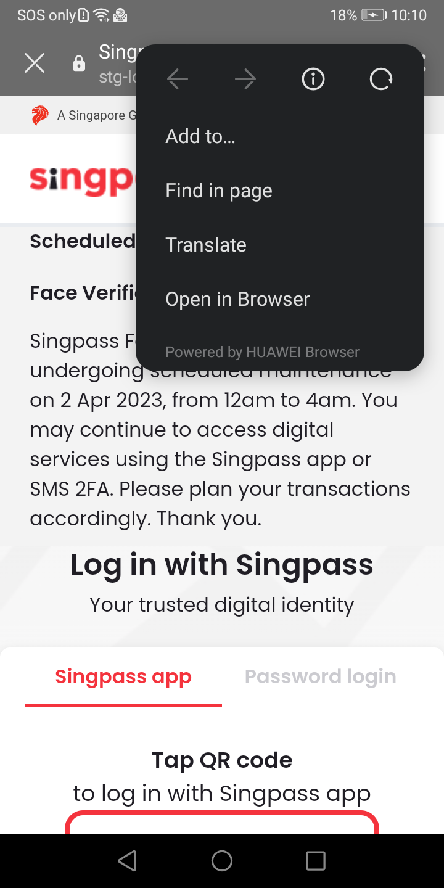</img> |

| Samsung Internet Browser CCT                                                                                                            |    
|-----------------------------------------------------------------------------------------------------------------------------------------|
| 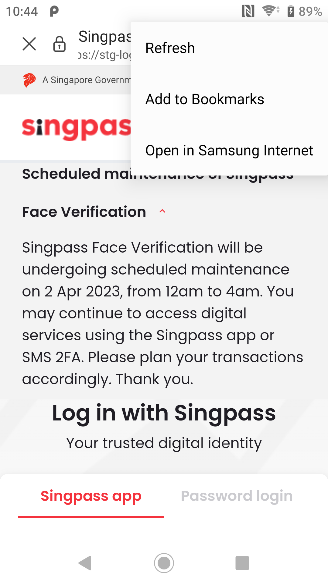</img> |

 

You can tell if the Singpass login page is opened in a external web browser by looking for the editable address bar. Below are 2 examples.

| Opera Web browser                                                                                            | DuckDuckGo Browser                                                                                             |     
|--------------------------------------------------------------------------------------------------------------|----------------------------------------------------------------------------------------------------------------|
| 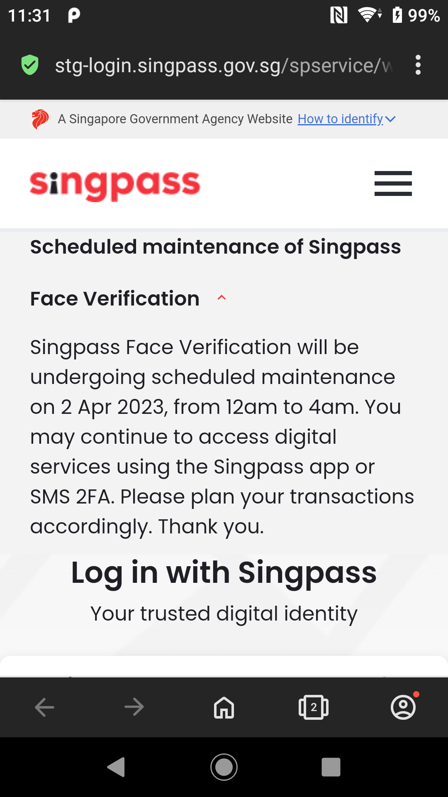</img> | 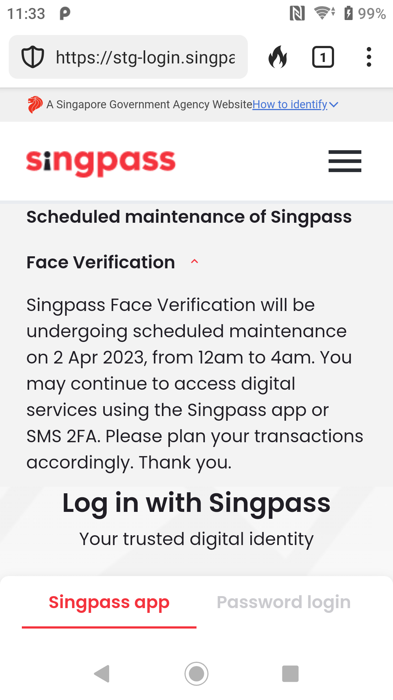</img> |

## Known issues

- As of 26th May 2023 we are seeing a bug on the `Microsoft Edge v113.0.1774.63` affecting app linking, where fallback url will be open mistakenly when launching Singpass app on QR code click. Please refer to [this](#Create-the-OAuth-authorization-service) to see how restrict specific browsers usage. Demo of the aforementioned behavior below, as compare to the expected behavior when using [Chrome](#Singpass-Login)
  
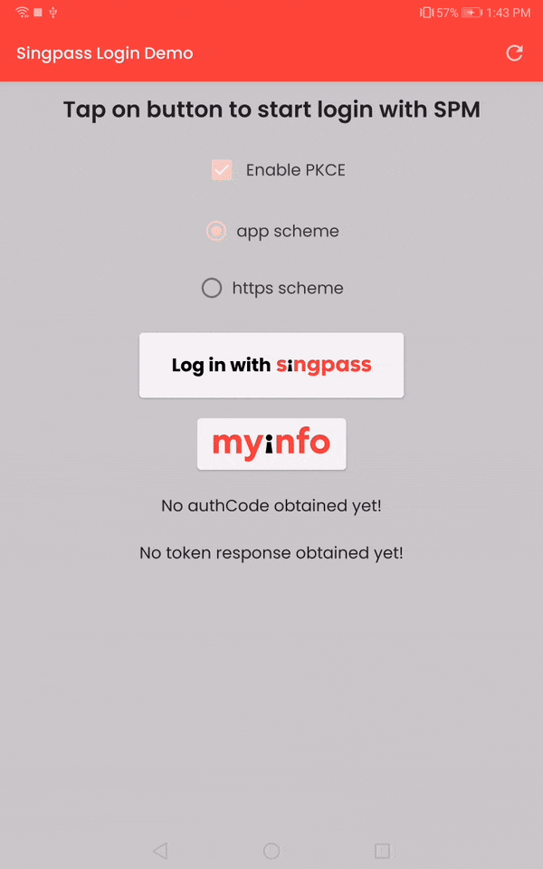</img>
  
- As of 9th June 2023 we are seeing a bug on the `Samsung Internet Browser v21.0.0.41` affecting app linking where customs tabs from Samsung Internet browser will close itself when launching Singpass app after clicking on QR code. Please refer to [this](#Create-the-OAuth-authorization-service) to see how restrict specific browsers usage. Demo of the aforementioned behavior below, as compare to the expected behavior when using [Chrome](#Singpass-Login)
    
  </img>

## Polling 

Vote [here](https://github.com/singpass/Android-Singpass-in-app-browser-login-demo/discussions/1) to indicate if you would like a library that handles all these implementation
